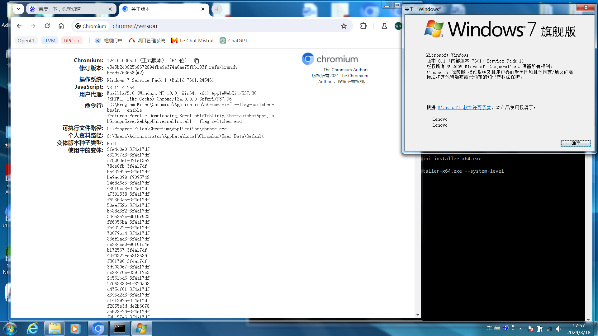

# Chromium for windows 7

Chromium is an open-source browser project that aims to build a safer, faster, and more stable way for all users to experience the web.

The latest version of Chromium no longer supports Windows 7. However, many of my friends are still using Windows 7 and they wish to use the latest version of Chromium on it. Therefore, I have created patches for Chromium versions 122, 123, 124, 125, 126, 127, 128, 129, 130, 131 and 132 to enable the browser to run on Windows 7.

## Platform Support

Windows 7, 8, 10, 11.



## Building

1. Follow the steps in [the instructions on how to get the code](https://chromium.googlesource.com/chromium/src/+/main/docs/windows_build_instructions.md) until the command `autoninja -C out\Default chrome`. 

   **Note**: These patches have only been tested on Chromium versions 122.0.6261.34, 122.0.6261.116, 123.0.6312.16, 123.0.6312.32, 124.0.6338.2, 124.0.6341.0, 124.0.6345.0, 124.0.6349.1, 124.0.6352.2, 124.0.6365.1, 124.0.6367.14, 125.0.6384.1, 125.0.6386.0, 125.0.6392.1, 125.0.6394.1, 125.0.6400.1, ..., and may not work on other versions. Therefore, you may need to use `git checkout` to switch to the corresponding Chromium version.

   **Note**: Make sure to disable chromium's clang plugin, as failing to do so will result in a failed compilation due to incompatibility between the patch and a certain chromium's clang plugin. To disable chromium's clang plugin, simply set `clang_use_chrome_plugins = false` in your args.gn.

   **Note**: Setting `target_cpu = "x86"` to build the 32-bit version, setting `target_cpu = "x64"` to build the 64-bit version, and other values for `target_cpu` are not supported.

   The suggested content in args.gn is:

   ```
   is_official_build = true
   is_component_build = false
   is_debug = false
   target_cpu = "x86"
   target_os = "win"
   clang_use_chrome_plugins = false
   ```

2. git clone https://github.com/e3kskoy7wqk/Chromium-for-windows-7.git.

3. Replace the string "E:\win7dep\chromium\src" with the location of the Chromium source code in **ALL** files named 'apply_patches.bat' in this repository.

4. Enter the appropriate directory based on the Chromium version you want to patch (e.g. 123.0.6312.16), then run **ALL** of the 'apply_patches.bat' files in the directory.

5. `autoninja -C out\Default chrome`
